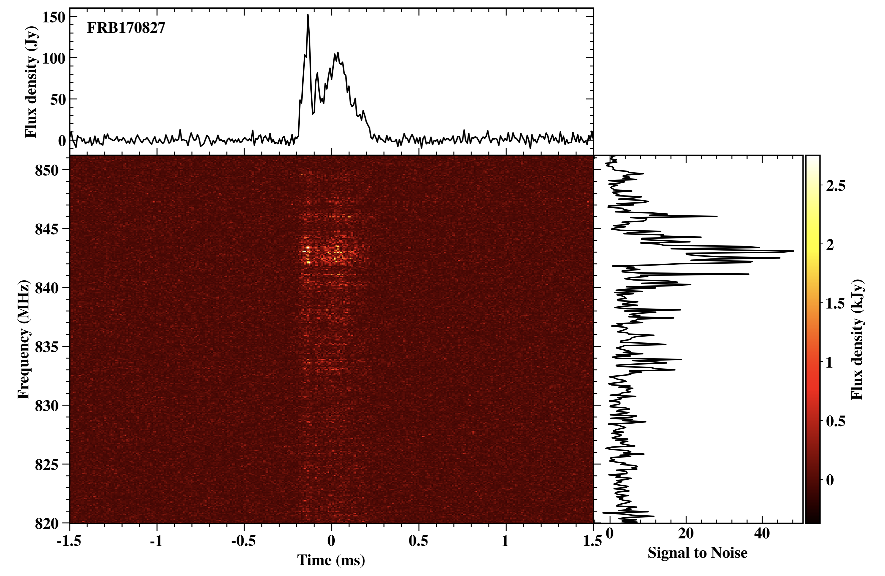

I am a radio astronomer. I completed my PhD at the Swinburne University of Technology in Melbourne,
studying Fast Radio Bursts (FRBs) and pulsars. FRBs are super bright, 
millisecond-wide "flashes"
in the radio spectrum that appear to originate from halfway across the universe. 
The emission mechanism of FRBs is yet to be unearthed, but there is mounting evidence that they 
originate from magnetars --- neutron stars that possess extremely powerful magnetic fields.
Given their impulsive nature, FRBs carry the imprint of the ionized plasma that they encounter on their journey to earth, making them ideal cosmological probes.

{:class="img-responsive"}
*FRB170827, published in Farah et al., 2017*

I currently work as a postdoctoral researcher at the [SETI Institute](http://seti.org){:target="_blank"}. 
My main focus is the refurbishement of the Allen Telescope Array (ATA), a 42 element 
interferometer located in north California. The ATA 

{:class="img-responsive"}
*The Allen Telescope Array under a starry night (image credit: Joe Marfia)*

My research interests are many, including the study of FRBs and pulsars, and the 
search for extraterrestrial intelligence (SETI). I am also interested in developing 
software for digital signal processing and in machine learning. 

When I am not behind a computer screen, I enjoy playing my piano, latin dancing, bouldering and weight lifting. 
