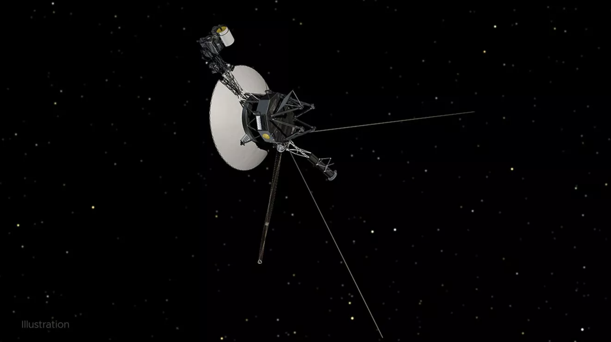

  

<!--
    <h2><a href="http://localhost:4000/blog/voyager1/">Detecting Voyager 1 with the ATA</a></h2>
    

      

      The farthest human-made object from our home planet detected by the Allen Telescope Array.

      <a href="http://localhost:4000/blog/voyager1/" title="Read Detecting Voyager 1 with the ATA"><strong>Read More&nbsp;›</strong></a>
    

-->

 

    <h2><a href="https://app.kidslisten.org/ep/The-Show-About-Science-087-The-Search-in-the-Stars-with-Wael-Farah" target="_blank">The Search in the Stars with Wael Farah</a></h2>
    

      

      Podcast: <a href="https://app.kidslisten.org/pod/The-Show-About-Science" target="_blank">The Show About Science</a> hosted by Nate, an incredibly talented 11 year old! 
       
       
      Nate and I spoke about Fast Radio Bursts, SETI and the Allen Telescope Array.

    

 
 

      <h2><a href="https://www.youtube.com/watch?v=Or_GMIWFJDA" target="_blank">Radio signals from our universe; Little green men or natural phenomena?</a></h2>
    

      Podcast hosted by Reza Katebi for <a href="https://www.youtube.com/channel/UCNYrETsy0jDHKhpabjNpXZw" target="_blank">The Edge of Science</a>. 
       
       

      <iframe width="420" height="315"
      src="https://www.youtube.com/embed/Or_GMIWFJDA" class=alignleft>
      </iframe>

    

 

      <h2><a href="https://www.seti.org/event/seti-talks-virtual-edition-fast-radio-bursts-long-standing-mystery-about-end" target="_blank">Fast Radio Bursts: A long-standing mystery about to end?</a></h2>
    

      I took part in a series of the <a href="https://www.seti.org/seti-talks" target="_blank">SETI Talks</a> with Daniele Michilli and hosted by Jill Tarter.
       
       

      <iframe width="420" height="315"
      src="https://www.youtube.com/embed/y8BWxrMjOlU" class=alignleft>
      </iframe>

    

  
<!-- /.small-12.columns -->

<!-- /.row -->

<!--        <a href="http://localhost:4000/blog/voyager1/" title="Read Detecting Voyager 1 with the ATA"><strong>Read More&nbsp;›</strong></a> -->
